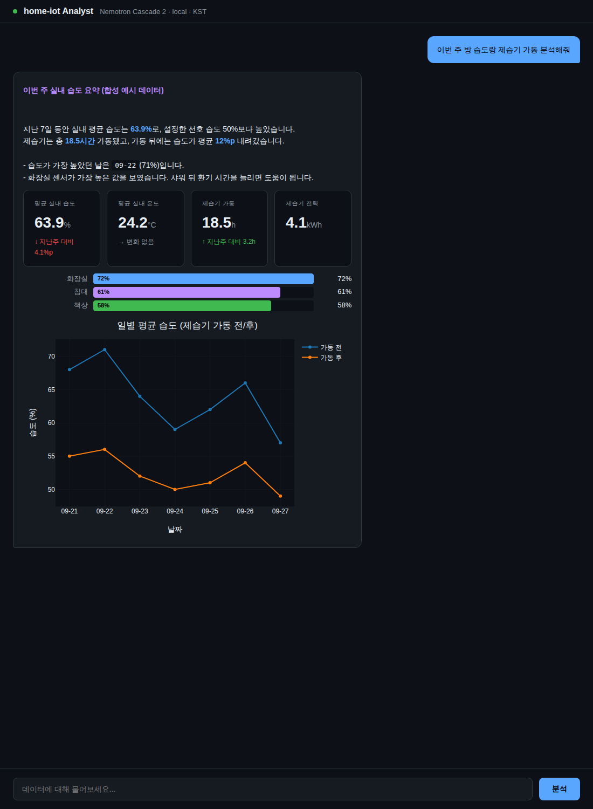
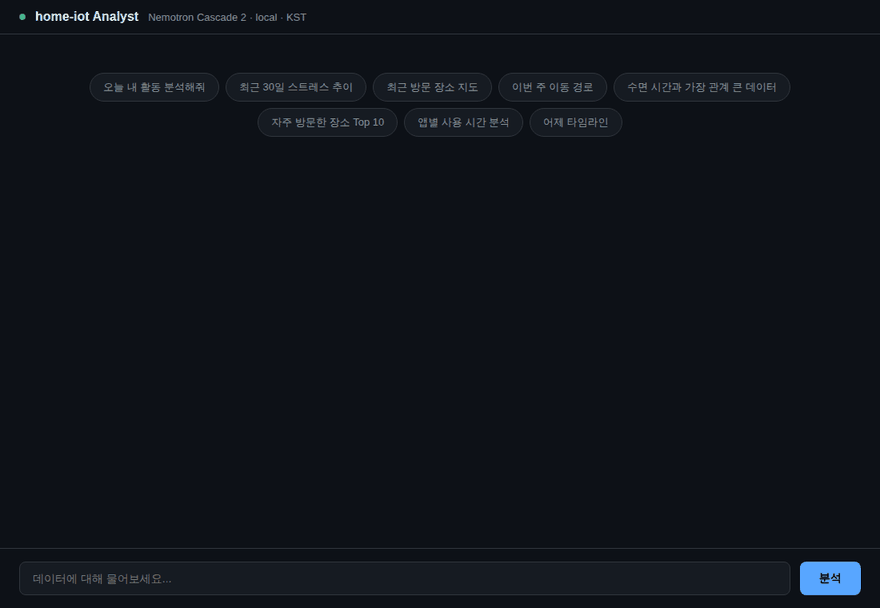

# home-iot

A local smart home hub that collects home device and personal activity data, then automates and analyzes it with a rule engine and a local LLM (Large Language Model) agent.

**English** | [한국어](README.md)



*The analyst chat (`analyst-chat`). This screenshot was taken by running the repository's real web server with a test stub standing in for Ollama that returns a fixed response. All numbers are synthetic sample data.*



## Features

- **Docker Compose stack**: starts HA (Home Assistant), the Mosquitto MQTT (Message Queuing Telemetry Transport) broker, InfluxDB 2, Grafana, Ollama and Telegraf together.
- **Hybrid agent** (`agent/`): receives HA events over WebSocket and passes them to the rule engine first. Only door, presence and location sensor changes that no rule handled go to the LLM, which reads and controls devices through tool calls.
- **17 agent tools** (`agent/src/home_iot/tools.py`): HA state reads and service calls, InfluxDB Flux queries, sleep and activity statistics, visited places and location trails, 7 knowledge-recording tools, and an approval request tool.
- **Shared knowledge base**: three YAML (YAML Ain't Markup Language) files in `agent/config/` (home layout, accumulated knowledge, pending questions) that both the agent and Claude sessions read and write.
- **Analyst chat** (`analyst-chat/`): ask questions in Korean in the browser; the LLM queries data and answers with charts, maps, timelines, tables, stat cards, ranked bars and Gantt charts.
- **Data importers** (`agent/scripts/`): load Samsung Health exports, Sleep as Android CSV (Comma-Separated Values) files and Google Takeout (Fit, Chrome history, Calendar, saved places) into InfluxDB.
- **Bridges**: send ActivityWatch window, AFK (away from keyboard) and browser events to InfluxDB and MQTT (runs inside the agent), and send Qingping air monitor cloud readings to MQTT (runs standalone).
- **Integrated analytics engine** (`agent/src/home_iot/analytics.py`): aligns data by day and computes correlations, predictors, anomalies, day clusters, weekday/weekend comparison and trends, then writes the results to InfluxDB.
- **7 Grafana dashboards** (`stack/grafana/dashboards/`): Home Overview, System Health, Desktop & Productivity, Sleep, Health & Activity, Correlations, Integrated Analytics.
- **Weekly review** (`agent/scripts/weekly_review.py`): packages a week of data, sends it to the Anthropic API (Application Programming Interface) and saves a Markdown report in `agent/reports/`.
- **Desktop audio player** (`desktop-audio-player/`): runs on a Windows PC, receives MQTT messages and plays ElevenLabs TTS (Text-to-Speech) audio or mp3 files.

## Usage

The setup assumes WSL (Windows Subsystem for Linux) or Linux with Docker and [uv](https://docs.astral.sh/uv/). The Ollama and Telegraf services reserve an NVIDIA GPU (Graphics Processing Unit); without one, remove their `deploy` blocks in `stack/docker-compose.yml`.

### 1. Start the stack

```bash
cd stack
docker compose up -d
```

| Service | Address | Purpose |
|---|---|---|
| Home Assistant | http://localhost:8123 | Device integrations, automations |
| Mosquitto | localhost:1883 (WebSocket 9001) | MQTT broker |
| InfluxDB | http://localhost:8086 | Time-series database, initial login `admin` / `homeiot-admin` |
| Grafana | http://localhost:3000 | Dashboards, initial login `admin` / `admin` |
| Ollama | http://localhost:11434 | Local LLM API |

These logins and the InfluxDB token (`homeiot-super-secret-token`) are local development defaults. Change them in `docker-compose.yml` before exposing anything. An example HA configuration is in `stack/homeassistant/config.example/`.

Pull the LLM model:

```bash
docker exec -it ollama ollama pull nemotron-cascade-2
```

### 2. Run the agent

```bash
cd agent
cp .env.example .env            # put an HA long-lived access token in HA_TOKEN
cp config/home_layout.example.yaml config/home_layout.yaml
cp config/home_knowledge.example.yaml config/home_knowledge.yaml
cp config/open_questions.example.yaml config/open_questions.yaml
uv sync
uv run home-iot-agent
```

Fill `home_layout.yaml` with your zones, devices, habits and safety boundaries. The agent also polls ActivityWatch at `http://localhost:5600`.

### 3. Run the analyst chat

It uses the agent's virtual environment and `.env`.

```bash
cd agent
uv run python ../analyst-chat/app.py
```

Open http://localhost:8501 and click an example button or type a question.

### 4. Import data and run analytics

```bash
cd agent
uv run python scripts/import_samsung_health.py [zip or folder path]
uv run python scripts/import_sleep_as_android.py [path to sleep-export.csv]
uv run python scripts/import_google_takeout.py [Takeout folder path]
uv run python scripts/refresh_analytics.py          # write analytics results to InfluxDB
ANTHROPIC_API_KEY=... uv run python scripts/weekly_review.py [--dry-run]
```

Without a path, the importers look in the folder given by `HOME_IOT_DOWNLOADS` (default `~/Downloads`).

### 5. Optional components

- Qingping bridge: set `QINGPING_APP_KEY` and `QINGPING_APP_SECRET`, then run `uv run python -m home_iot.bridges.qingping` to poll once and publish to MQTT.
- Desktop audio player: follow [desktop-audio-player/README.md](desktop-audio-player/README.md). Set `HOME_IOT_MQTT_HOST` to the WSL side IP (Internet Protocol) address.
- Life Explorer (`dashboards/`): builds a map-based HTML (HyperText Markup Language) dashboard from `/tmp/explorer_data.json`. The collection script that produces this JSON (JavaScript Object Notation) file is not in the repository. Set `LIFE_EXPLORER_OUT` to change the output path.

The Grafana Desktop & Productivity dashboard assumes the HASS.Agent device name is `lab_pc` (`sensor.lab_pc_cpuload_2` and so on). If your device name differs, edit the entity names in the dashboard queries.

## Tech stack

| Area | Technology |
|---|---|
| Languages | Python 3.12+ (agent), JavaScript (web UI (User Interface)), PowerShell (Windows launcher) |
| Agent libraries (`uv.lock`) | httpx 0.28.1, websockets 16.0, aiomqtt 2.5.1, pydantic 2.12.5, pydantic-settings 2.13.1, structlog 25.5.0, influxdb-client 1.50.0, PyYAML 6.0.3 |
| Analytics | pandas 3.0.2, NumPy 2.4.4, SciPy 1.17.1, scikit-learn 1.8.0 |
| Web server | FastAPI 0.135.3, Uvicorn 0.43.0 |
| Web UI | Plotly.js 2.35.2, Leaflet 1.9.4, Leaflet.heat 0.2.0 |
| Infrastructure (Docker images) | home-assistant `stable`, eclipse-mosquitto `2`, influxdb `2`, grafana `latest`, ollama `latest`, telegraf `latest` |
| LLM | Ollama + Nemotron Cascade 2 (default model), bge-m3 (configured embedding model), Anthropic API (weekly review) |
| Audio player | paho-mqtt 2.0+, httpx, miniaudio, ElevenLabs API |
| Packaging | uv, hatchling |

## Docs

- [Progress record](docs/PROGRESS.en.md): final goal, per-feature implementation status, work history
- [Agent structure](agent/README.md) (Korean)
- [Desktop audio player](desktop-audio-player/README.md)
- `reference/`: the early custom MQTT bridge code. It is no longer used and is kept for reference only.
- `CLAUDE.md`: working guide for Claude sessions.
